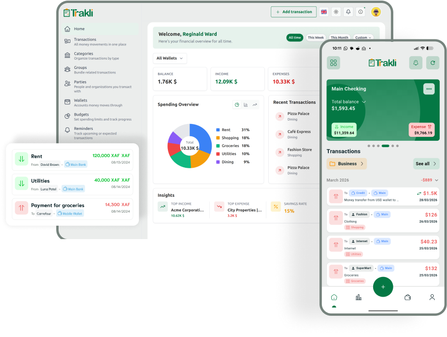

<p align="center"><a href="#" target="_blank"></a></p>

<p align="center"></p>

# Trakli Webservice

[](https://github.com/trakli/webservice/actions/workflows/tests.yml)
[](https://github.com/trakli/webservice/actions/workflows/lint-sniffs.yml)

## Overview

Trakli is a personal income tracking application built using Laravel. The application allows users to manage and categorize their income and expenses under various groups and categories.

## Features

- **Transactions:** Income and expenses across multiple wallets, with attachments and recurring rules.
- **Transfers:** Move money between wallets, including cross-currency at user-set rates.
- **Budgets:** Scoped to categories, groups, or wallets; weekly / monthly / yearly / custom range; optional rollover; threshold and forecast alerts.
- **Refunds:** Mark an income as refunding an earlier expense; matching budgets adjust automatically.
- **Reminders:** Bills, budget alerts, and custom events with pause, resume, and snooze.
- **Imports:** Pull transactions from CSVs, PDFs, and photos of receipts.
- **Insights & AI:** Dashboard stats, digest emails, and a chat assistant for your finances.
- **Offline-first:** Changes made on mobile sync cleanly when the device reconnects.

## Setup instructions

### Prerequisites

- Docker
- Docker Compose
- Make

### Quick installation guide
- `git clone git@github.com:whilesmart/trakli-webservice.git`
- `cd trakli-webservice`
- `cp .env.example .env`
- `make setup`

### Development Commands
- `make up` - Start containers
- `make down` - Stop containers
- `make restart` - Restart containers
- `make test` - Run tests
- `make lint` - Check code style
- `make lint-fix` - Fix code style issues
- `make phpmd` - Runs PHP Mess Detector
- `make phpstan` - Runs PHP Static Analyzer
- `make format` - Additional code style checks
- `make format-fix` - Fix additional code style issues
- `make migrate` - Run database migrations
- `make migrate-fresh` - Fresh migrations (drops all tables)
- `make seed` - Run database seeders
- `make migrate-fresh-seed` - Fresh migrations + seeders
- `make optimize` - Optimize Laravel application (cache config, routes, views)
- `make tinker` - Open Laravel Tinker REPL
- `make bash` - Access container bash shell
- `make logs` - View application logs
- `make fix-permissions` - Fix file permission issues

For detailed and explained installation steps see : [INSTALLATION.md](INSTALLATION.md)

### Accessing the Application

- The application will be available at `http://localhost:8000`.
- API documentation will be accessible at `http://localhost:8000/docs/swagger`.

### Stopping the Containers

To stop the Docker containers, run:

```bash
make down
```

### LICENSE

```
MIT License

Permission is hereby granted, free of charge, to any person obtaining a copy
of this software and associated documentation files (the "Software"), to deal
in the Software without restriction, including without limitation the rights
to use, copy, modify, merge, publish, distribute, sublicense, and/or sell
copies of the Software, and to permit persons to whom the Software is
furnished to do so, subject to the following conditions:

The above copyright notice and this permission notice shall be included in all
copies or substantial portions of the Software.

THE SOFTWARE IS PROVIDED "AS IS", WITHOUT WARRANTY OF ANY KIND, EXPRESS OR
IMPLIED, INCLUDING BUT NOT LIMITED TO THE WARRANTIES OF MERCHANTABILITY,
FITNESS FOR A PARTICULAR PURPOSE AND NONINFRINGEMENT. IN NO EVENT SHALL THE
AUTHORS OR COPYRIGHT HOLDERS BE LIABLE FOR ANY CLAIM, DAMAGES OR OTHER
LIABILITY, WHETHER IN AN ACTION OF CONTRACT, TORT OR OTHERWISE, ARISING FROM,
OUT OF OR IN CONNECTION WITH THE SOFTWARE OR THE USE OR OTHER DEALINGS IN THE
SOFTWARE.
```
